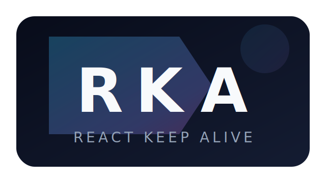

# rkajs [](https://npmjs.com/package/rkajs)

<p align="center">
  <a href="https://github.com/sunny-117/rka">
    
  </a>
</p>

## ✨ Features
- Lightweight
- You will be able to use the latest React Hooks.
- Not based on React Router, so you can use it wherever you need to cache it.
- You can easily use `<KeepAlive>` to wrap your components to keep them alive.
- Because it is not controlled by `display: none | block`, you can use animation.
- Ability to manually control whether your components need to stay active.
- Programmatic cache lifecycle control through the new `useKeepAlive` hook.

## 📦 Installation

To use rka with your React app:

```bash
npm install rkajs
yarn add rkajs
pnpm i rkajs
bun i rkajs
```

## Usage


```tsx
import { KeepAlive, KeepAliveTransfer, useKeepAlive } from "rkajs";
import { BrowserRouter, Link, Routes, Route } from "react-router-dom";
import Home from "./pages/Home";
import Form from "./pages/Form";

const AliveHomeView = KeepAliveTransfer(Home, "home");
const AliveFormView = KeepAliveTransfer(Form, "form");

function Controls() {
  const { refresh, drop } = useKeepAlive();

  return (
    <div>
      <button onClick={() => refresh("home")}>Refresh home</button>
      <button onClick={() => drop("form")}>Drop form cache</button>
    </div>
  );
}

export default function App() {
  return (
    <BrowserRouter>
      <KeepAlive>
        <div>
          <Controls />
          <ul>
            <li>
              <Link to={"/"}>Home</Link>
            </li>
            <li>
              <Link to={"/form"}>Form</Link>
            </li>
          </ul>
          <div>
            <Routes>
              <Route path="/" element={<AliveHomeView></AliveHomeView>}></Route>
              <Route
                path="/form"
                element={<AliveFormView></AliveFormView>}
              ></Route>
            </Routes>
          </div>
        </div>
      </KeepAlive>
    </BrowserRouter>
  );
}
```

> `useKeepAlive` must be called from a descendant of `<KeepAlive>`.

## 💡 Why do you need this component?

If you've used [Vue](https://vuejs.org/), you know that it has a very good component ([keep-alive](https://vuejs.org/v2/guide/components-dynamic-async.html)) that keeps the state of the component to avoid repeated re-rendering.

Sometimes, we want the list page to cache the page state after the list page enters the detail page. When the detail page returns to the list page, the list page is still the same as before the switch.

Oh, this is actually quite difficult to achieve, because the components in React cannot be reused once they are uninstalled. Two solutions are proposed in [issue #12039](https://github.com/facebook/react/issues/12039). By using the style switch component display (`display: none | block;`), this can cause problems, such as when you switch components, you can't use animations; or use data flow management tools like Mobx and Redux, but this is too much trouble.

In the end, I implemented this effect through the [React.createPortal API](https://reactjs.org/docs/portals.html). `react-keep-alive` has two main components `<Provider>` and `<KeepAlive>`. The `<Provider>` is responsible for saving the component's cache and rendering the cached component outside of the application via the React.createPortal API before processing. The cached components must be placed in `<KeepAlive>`, and `<KeepAlive>` will mount the components that are cached outside the application to the location that really needs to be displayed.


## 🐛 Issues

If you find a bug, please file an issue on [our issue tracker on GitHub](https://github.com/Sunny-117/rka/issues).


## 📄 License

rks is available under the [MIT](./LICENSE) License.


## Inspired

Inspired by [react-keep-alive](https://github.com/StructureBuilder/react-keep-alive/)